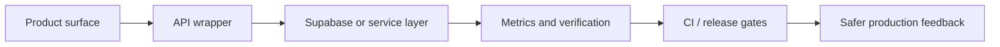

<div align="center">


[](https://git.io/typing-svg)

[](https://github.com/ankitkumarsingh1702)
[](https://github.com/hushh-labs)
[](https://github.com/ankitkumarsingh1702)

</div>

## Mission Control

I build product-facing Hushh/Hussh systems across web, mobile, backend, data, and release automation. My public GitHub signal is strongest inside [`hushh-labs`](https://github.com/hushh-labs), where I work on AI product surfaces, RIA and agent workflows, consent-aware systems, Supabase integrations, security hardening, repo governance, CI, and dashboards that make product teams move faster.

```txt
operator.profile = {
  focus: ["Hushh AI", "agent discovery", "consent flows", "metrics", "developer ops"],
  frontend: ["React", "TypeScript", "Vite", "Next.js", "Tailwind"],
  backend: ["Python", "FastAPI", "Supabase", "API orchestration"],
  mobile: ["SwiftUI", "Flutter", "Dart", "Kotlin experiments"],
  bias: "smallest useful system first, then harden with real users"
}
```

## Currently Shipping

| Track | What I am building | Public signal |
| --- | --- | --- |
| Hushh AI | KAI, RIA workflows, AI search/console work, personal-data experiments, and product research surfaces | [`hushh-labs/hushh-research`](https://github.com/hushh-labs/hushh-research) |
| Hushh Technologies | Web/app product surfaces, API wrappers, Supabase paths, metrics dashboards, tests, CI, security, and repo governance | [`hushh-labs/hushh_Tech_website`](https://github.com/hushh-labs/hushh_Tech_website) |
| Hushh Agents | Browse-first RIA/agent discovery, onboarding, profiles, release/TestFlight work, and agent workspace prototypes | [`hushh-labs/hushh-agents`](https://github.com/hushh-labs/hushh-agents) |
| Consent Protocol | Consent-first backend paths for personal data agents, FastAPI services, Supabase integration, and safe automation | [`hushh-labs/consent-protocol`](https://github.com/hushh-labs/consent-protocol) |

## Live Signal

<div align="center">


</div>

## Featured Systems

<div align="center">

[](https://github.com/hushh-labs/hushh_Tech_website)
[](https://github.com/hushh-labs/hushh-research)

[](https://github.com/hushh-labs/consent-protocol)
[](https://github.com/ankitkumarsingh1702/hushh-agents-clean)

</div>

| Project | Stack | Signal |
| --- | --- | --- |
| [`hushh_Tech_website`](https://github.com/hushh-labs/hushh_Tech_website) | React, TypeScript, Vite, Supabase, APIs | Public Hushh web/app wrapper, metrics, tests, CI, security hygiene, and repo governance |
| [`hushh-agents`](https://github.com/hushh-labs/hushh-agents) | SwiftUI, Supabase, iOS | Browse-first RIA/agent discovery app with swipe deck, auth/onboarding, profiles, and release work |
| [`hushh-agents-clean`](https://github.com/ankitkumarsingh1702/hushh-agents-clean) | TypeScript, React, Vite, Supabase | Personal agent-discovery prototype with onboarding screens, Supabase functions, migrations, and data tooling |
| [`hushh-research`](https://github.com/hushh-labs/hushh-research) | TypeScript, Python, MCP | Research/product monorepo contributions around RIA access, backend services, tests, and governance |
| [`consent-protocol`](https://github.com/hushh-labs/consent-protocol) | Python, FastAPI, Supabase | Consent-first backend work in the Hushh personal-data-agent ecosystem |
| [`hushh.ai-website`](https://github.com/hushh-labs/hushh.ai-website) | JavaScript | Public Hushh AI website work tied to product storytelling, developer surfaces, and responsive UI fixes |

## Tech Stack

<div align="center">

[](https://skillicons.dev)

</div>

| Zone | Tools and patterns |
| --- | --- |
| Product UI | TypeScript, React, Next.js, Vite, component systems, responsive UX |
| Backend + APIs | Python, FastAPI, Supabase, auth flows, service orchestration, integration wrappers |
| Mobile | SwiftUI, Flutter, Dart, Kotlin experiments, app onboarding, profile flows |
| Data + AI | Jupyter, statistics, ML notebooks, AI search/console experiments, agent workflows |
| Automation | GitHub Actions, branch protection, CI/CD, cloud jobs, smoke tests, reporting systems |

## Automation & Ops



- I like automation that behaves like a product surface: observable, reversible, least-privilege, and useful to the people shipping the work.
- I prefer official APIs, managed secrets, scripted checks, and evidence-backed status over manual clicking.
- I write docs and governance when they reduce review friction, protect the repo, or make onboarding faster.

## Engineering Values

```txt
ship.minimum_viable_system()
listen.to_real_feedback()
harden.with_tests_and_observability()
document.tradeoffs()
automate.reversible_paths()
```

- Build the smallest useful system first, then strengthen it with real feedback.
- Keep APIs clear, architecture readable, and tradeoffs documented.
- Treat consent, security, and user trust as core product requirements.
- Make engineering systems practical, fast, and grounded in the real workflow.

<div align="center">


</div>
